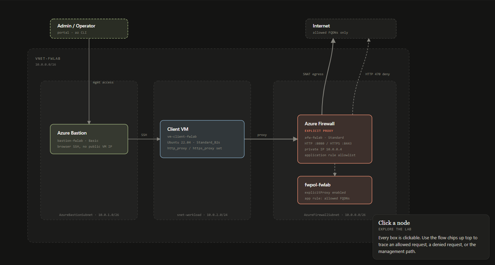
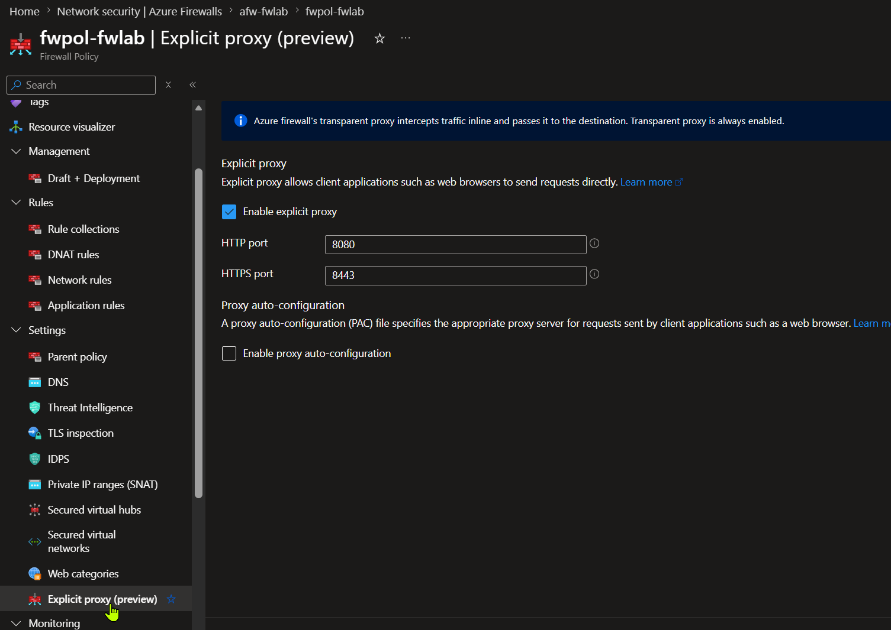

# Azure Firewall Explicit Proxy - Test Lab

A self-contained lab to deploy and validate the **Azure Firewall explicit proxy** feature (currently in preview). Clients point their proxy setting at the firewall's **private IP** (separate HTTP/HTTPS ports) and egress directly through the firewall - no UDRs required. Traffic is allowed/denied by firewall **application rules**.

> ⚠️ Explicit proxy is a **preview** feature. Don't use this pattern in production without validating against the latest [Microsoft docs](https://learn.microsoft.com/azure/firewall/explicit-proxy).

## Contents

- [Architecture](#architecture)
- [What gets deployed](#what-gets-deployed)
- [Repository layout](#repository-layout)
- [Run in GitHub Codespaces](#run-in-github-codespaces)
- [Prerequisites](#prerequisites)
- [Deploy](#deploy)
- [Viewing the explicit proxy setting in the Azure portal](#viewing-the-explicit-proxy-setting-in-the-azure-portal)
- [Test the proxy](#test-the-proxy)
- [Making clients actually use the proxy](#making-clients-actually-use-the-proxy)
- [Other extensions to try](#other-extensions-to-try)
- [Cost & teardown](#cost--teardown)

## Architecture

**▶ [Open the interactive architecture diagram](https://samsmith-msft.github.io/azure-fw-explicit-proxy-lab/diagram/architecture.html)** - click nodes for detail, use the flow chips to trace an allowed request, a denied request, or the management path, and toggle light/dark.

[](https://samsmith-msft.github.io/azure-fw-explicit-proxy-lab/diagram/architecture.html)

> The image above is a static preview; click it (or the link) for the live interactive version. The self-contained source is at [`diagram/architecture.html`](diagram/architecture.html) - open it in any browser, no server needed. (GitHub renders READMEs without JavaScript, so the diagram can't run inline here; it's hosted via GitHub Pages.)

## What gets deployed

| Resource | Name | Notes |
|---|---|---|
| Virtual network | `vnet-fwlab` | `10.0.0.0/16` |
| Subnets | `AzureFirewallSubnet` / `snet-workload` / `AzureBastionSubnet` | `10.0.0.0/26` / `10.0.2.0/24` / `10.0.1.0/26` |
| Azure Firewall (Standard) | `afw-fwlab` | private IP `10.0.0.4` |
| Firewall Policy | `fwpol-fwlab` | **explicit proxy ON**, HTTP `8080` / HTTPS `8443`, app-rule allowlist |
| Public IP (firewall) | `pip-afw-fwlab` | egress SNAT |
| Bastion (Basic) | `bastion-fwlab` | management access to the client VM |
| Linux client VM | `vm-client-fwlab` | Ubuntu 22.04, `Standard_B2s`, **no public IP** |

## Repository layout

```
infra/
  fwlab.bicep          # the full lab template
scripts/
  test-proxy.sh        # curl tests run from the client VM (allow + deny + bypass)
  teardown.ps1         # delete the resource group
diagram/
  architecture.html    # interactive architecture diagram (self-contained, open in a browser)
architecture.png       # static preview of the diagram (shown above)
REPORT.md              # post-deployment report (inventory, cost, posture)
```

## Run in GitHub Codespaces

This repo ships a **dev container** with everything preinstalled (Azure CLI + Bicep, GitHub CLI, PowerShell) - zero local setup.

1. On the repo page: **`<> Code` ▸ Codespaces ▸ Create codespace on `main`**.
2. Wait for the container to build (first launch ~1-2 min; `az bicep` is installed automatically).
3. **Use a bash terminal.** The dev container is Linux and all commands below are bash. The integrated terminal defaults to bash, but if yours opens a different shell (e.g. you have a personal default shell set), start bash first by typing `bash` and pressing Enter, or open a new terminal with **Terminal ▸ New Terminal** and pick **bash** from the `+` dropdown. (PowerShell line-continuation backticks will break these bash commands.)
4. In the Codespace terminal:
   ```bash
   az login --use-device-code
   az account set --subscription "<your-subscription-id>"
   az group create -n rg-fwproxy-lab -l eastus2
   az deployment group create -g rg-fwproxy-lab -n fwlab-deploy \
     --template-file infra/fwlab.bicep --parameters adminPassword='<StrongP@ssw0rd!>'
   ```
5. Run the proxy tests (see [Test the proxy](#test-the-proxy)); tear down with `az group delete -n rg-fwproxy-lab --yes` when done.

Prefer your own machine? Use the local path below instead.

## Prerequisites

- Azure CLI (`az`) ≥ 2.60 and the Bicep CLI (`az bicep install`)
- An Azure subscription where you can create Azure Firewall, Bastion, and a VM
- Permissions: Contributor on the target subscription/RG
- The explicit-proxy preview available in your target region

## Deploy

```bash
# 1. Sign in and select your subscription
az login
az account set --subscription "<your-subscription-id>"

# 2. Create the resource group
az group create -n rg-fwproxy-lab -l eastus2

# 3. Validate, then deploy (you'll be prompted for a strong VM admin password)
read -s -p "VM admin password: " pw; echo
az deployment group validate -g rg-fwproxy-lab --template-file infra/fwlab.bicep --parameters adminPassword="$pw"
az deployment group create  -g rg-fwproxy-lab -n fwlab-deploy --template-file infra/fwlab.bicep --parameters adminPassword="$pw"
```

The firewall + Bastion take ~10-15 minutes. The deployment outputs the firewall private IP, the **VM admin username**, and ready-to-run test commands.

> **VM login:** the admin **username defaults to `azureuser`** (the `adminUsername` parameter in `infra/fwlab.bicep`); the password is whatever you supplied as `adminPassword`. To use a different username, add `--parameters adminUsername=<name> adminPassword="$pw"`. After deploy you can always read it back with:
> ```bash
> az deployment group show -g rg-fwproxy-lab -n fwlab-deploy --query "properties.outputs.vmAdminUsername.value" -o tsv
> ```

> 💡 **Windows PowerShell users:** these examples are bash (the dev container / Codespaces default). In PowerShell, replace the password prompt with `$pw = Read-Host "VM admin password"` and use a backtick (`` ` ``) instead of `\` for line continuation.

## Viewing the explicit proxy setting in the Azure portal

The Bicep template enables explicit proxy for you, but you can inspect (or change) it in the portal:

1. Go to **Home ▸ Firewall Policies** (or search **Firewall policies**) and open **`fwpol-fwlab`**. You can also start from the firewall **`afw-fwlab`** and follow its linked policy.
2. In the left menu, under **Settings**, select **Explicit proxy (preview)**.
3. You'll see the configuration this lab deploys: **Enable explicit proxy** checked, **HTTP port `8080`**, **HTTPS port `8443`**, and **Proxy auto-configuration (PAC)** left disabled.



> Note: HTTP and HTTPS ports must be different. The banner up top is a reminder that Azure Firewall's *transparent* proxy is always on; **explicit** proxy is the opt-in mode clients point at directly (see [Making clients actually use the proxy](#making-clients-actually-use-the-proxy)). To serve a PAC file from the firewall, tick **Enable proxy auto-configuration** and provide a SAS URL + port (or set `enablePacFile: true` in the Bicep).

## Test the proxy

> ⏳ **Wait ~10 minutes after the deployment reports success before testing.** The firewall policy and explicit-proxy configuration take several minutes to propagate to the Azure Firewall data plane after the ARM deployment completes. If you test immediately, the `curl`s may time out or fail even though everything deployed correctly. Give it ~10 minutes; if a test still fails, wait a few more and retry before assuming a config problem.

Run the tests from the client VM (no public IP needed) via `az vm run-command`:

```bash
az vm run-command invoke -g rg-fwproxy-lab -n vm-client-fwlab \
  --command-id RunShellScript --scripts "@scripts/test-proxy.sh" \
  --query "value[0].message" -o tsv
```

Or connect interactively through **Bastion** (Azure portal → `vm-client-fwlab` → Connect → Bastion, sign in as **`azureuser`** with the password you set at deploy) and run:

```bash
# Allowed FQDN over the HTTP proxy port - returns the firewall's public IP
curl -x http://10.0.0.4:8080 http://ifconfig.me

# Allowed FQDN over the HTTPS proxy port - returns 200
curl -x http://10.0.0.4:8443 https://www.microsoft.com -o /dev/null -w "%{http_code}\n"

# NOT in the allowlist - firewall denies with HTTP 470
curl -x http://10.0.0.4:8443 https://www.google.com -o /dev/null -w "%{http_code}\n"
```

### Expected results

| Test | Expected |
|---|---|
| HTTP proxy → allowed FQDN | firewall public IP returned |
| HTTPS proxy → allowed FQDN | `200` |
| HTTPS proxy → non-allowed FQDN | **denied** - `curl (56) HTTP code 470 from proxy after CONNECT` |

To allow more destinations, edit the `allow-test-fqdns` application rule in `infra/fwlab.bicep` (`targetFqdns`) and redeploy.

## Making clients actually use the proxy

Two **separate** things are required - and the order matters:

**1. Configure the client to use the proxy (this is what actually routes traffic).**
Explicit proxy is **opt-in per client**. Nothing reaches the firewall on `:8080`/`:8443` until the client (or app) is pointed at it. Out of the box, the VM uses Azure **default outbound internet** directly, which is why a plain `curl` (no `-x`) still works. To send traffic through the proxy, configure the client - e.g. on the Linux VM:

```bash
# session-wide (note: https_proxy points at the proxy over http)
export http_proxy=http://10.0.0.4:8080
export https_proxy=http://10.0.0.4:8443
export no_proxy=169.254.169.254,168.63.129.16,localhost   # keep IMDS/WireServer/local direct

# persist for all users:
sudo tee /etc/environment >/dev/null <<'EOF'
http_proxy=http://10.0.0.4:8080
https_proxy=http://10.0.0.4:8443
no_proxy=169.254.169.254,168.63.129.16,localhost
EOF
```

`curl`/`apt`/most tools honor `http_proxy`/`https_proxy`. GUI browsers/apps may need their own proxy setting or a **PAC file** (the firewall can host one - set `enablePacFile: true` + SAS URL + `pacFilePort`).

**Test it once the env vars are set** - no `-x` flag needed; the tools pick up the proxy automatically:

```bash
# allowed FQDN - succeeds through the proxy, returns the firewall's public IP
curl -sS http://ifconfig.me ; echo

# allowed HTTPS FQDN - returns 200
curl -sS https://www.microsoft.com -o /dev/null -w "%{http_code}\n"

# non-allowed FQDN - firewall denies (curl exits 56, "HTTP code 470 from proxy after CONNECT")
curl -sS https://www.google.com -o /dev/null -w "%{http_code}\n" || echo "BLOCKED"

# prove the env vars are in effect
env | grep -i proxy
```

To temporarily bypass the proxy for one command (e.g. to confirm the contrast), unset it inline:
```bash
http_proxy= https_proxy= curl -sS http://ifconfig.me ; echo   # goes direct (until an NSG blocks it)
```

**2. (Optional, defense-in-depth) Block the bypass so the proxy can't be skipped.**
Only *after* clients are configured, prevent direct egress so nothing can sidestep the proxy:

- an **NSG** on `snet-workload` denying outbound to `Internet` on 80/443 (leave the firewall private IP / proxy ports allowed), and/or
- a subnet with **default outbound access disabled**.

> ⚠️ Don't add the NSG *before* configuring the client - an NSG that denies direct egress does **not** redirect traffic to the proxy; it just breaks connectivity for anything not already pointed at it. Configure the client first, verify it works through the proxy, then clamp down.

## Other extensions to try
- **TLS inspection** of proxied HTTPS → requires **Firewall Premium** (`sku.tier = 'Premium'`) + a CA cert in the policy.
- **PAC file hosting** → upload a PAC file to blob storage, set `enablePacFile: true` with a SAS URL and `pacFilePort`.

## Cost & teardown

Azure Firewall + Bastion bill on the order of **~$1,000+/month** if left running. Tear down when finished:

```bash
# simplest - works in any shell with az:
az group delete -n rg-fwproxy-lab --yes --no-wait

# or run the helper script (PowerShell is preinstalled in the dev container):
pwsh scripts/teardown.ps1
```

See [`REPORT.md`](REPORT.md) for the realized inventory, cost breakdown, and security posture of the deployed lab.
